  

## SaaS I've Built

<h3>
Product Engineering
</h3>

  In April 2021, I joined <a href="https://businesschat.io">BusinessChat</a> as a founding engineer, building marketing automation and customer support tools.

<h3>
Programming Languages
</h3>

  In July 2019, I co-created <a href="https://pragmalang.com/">Pragma</a>, a language for effortlessly creating elegant GraphQL APIs.

## Social
Contact me on [LinkedIn](https://linkedin.com/in/muhammad-tabaza). Follow me to get a thought-provoking post every now and then.

## Experience

```mermaid
mindmap
  root((Experience))
    ((Backend Dev))
      ((Scala))
        (Cats)
        (Cats Effect)
        (Kittens)
        (Droste)
        (Http4s)
        (Doobie)
        (Tapir)
        (Fs2)
        (Caliban)
        (Circe)

      ((Kotlin))
        (Spring Boot)
        (Micrometer)
        (Jooq)
  
      ((Elixir))
        (Ecto)
        (Absinthe)
        (Phoenix)
  
      ((JS/TS))
        (Express)
        (NestJS)
        (TypeORM)
        (KnexJS)
      
    ((Frontend Dev))
      (React)
      (Redux)
      (RxJS)
      (Angular)
      (TyprScript)
      (ReScript)
      
    ((DevOps))
      (GitHub Actions)

      ((Observability))
        (OpenTelemetry)
        (Grafana)
        (Grafana Tempo)
        (Grafana Loki)

      ((Google Cloud))
        (App Engine)
        (Compute Engine)
        (Cloud SQL)
        (Memorystore)
        (Pub/Sub)
        (Cloud Storage)
        (Cloud Batch)

    ((Databases))
      (PostgreSQL)
      (Redis)
      (Elasticsearch)
      (BigQuery)
```

## Tinkering

Take a look at [my stack](https://github.com/stars/m-tabaza/lists/my-stack) for more.

## Blog Posts
* [How Two WhatsApp Chat Bots Had a Fight](https://www.linkedin.com/pulse/how-two-whatsaapp-chat-bots-had-fight-muhammad-tabaza/) (2022)
* [Mindless Learning](https://github.com/Tabzz98/Tabzz98/blob/main/blog/Mindless%20Learning.md) (2022)
* [Functional Programming: The Simple Version](https://medium.com/heavenlyx/functional-programming-the-simple-version-63fe10678f6e) (2020)
* [A Guide to Scala 3](https://medium.com/heavenlyx/a-guide-to-scala-3-8a3bad7eee71) (2019)
* [The Scala Collections Library](https://medium.com/heavenlyx/the-scala-collections-library-173ca624fb8d) (2019)
* [Parsing The World with Rust and POM](https://medium.com/heavenlyx/parsing-the-world-with-rust-and-pom-77e0e8b5313d) (2019)
* [Machine Learning: From Zero to Slightly Less Confused](https://dev.to/tabz_98/machine-learning-from-zero-to-slightly-less-confused-2bal) (2019)
* [RxJS From Scratch](https://medium.com/@muhammadtabaza/rxjs-almost-from-scratch-3a8b9e8b6d80) (2018)
* [FeathersJS For The Beginner: Hello World!](https://medium.com/@muhammadtabaza/feathersjs-for-the-beginner-hello-world-262ca46f7db7) (2018)
* [FeathersJS For The Beginner: Basic concepts](https://medium.com/@muhammadtabaza/feathersjs-for-the-beginner-basic-concepts-b5abba2e888a) (2018)
